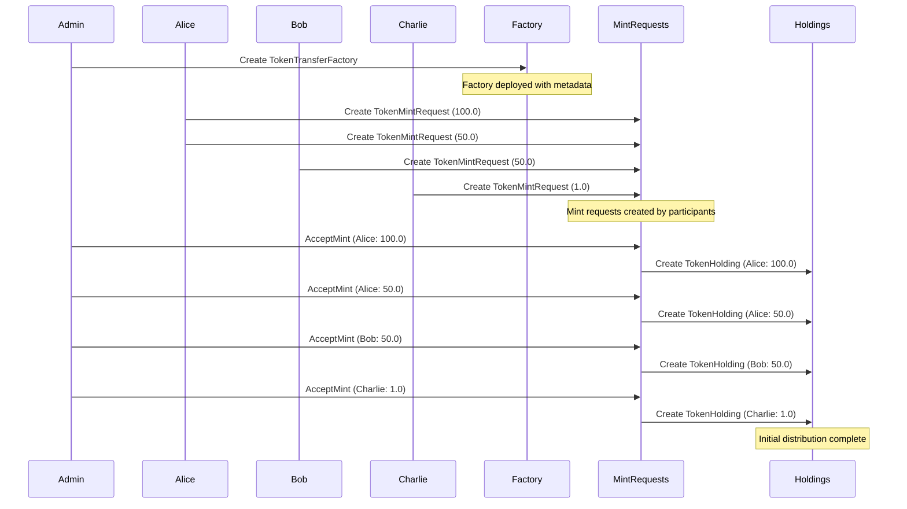
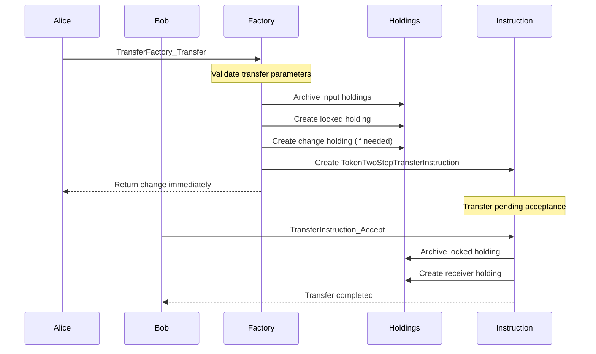
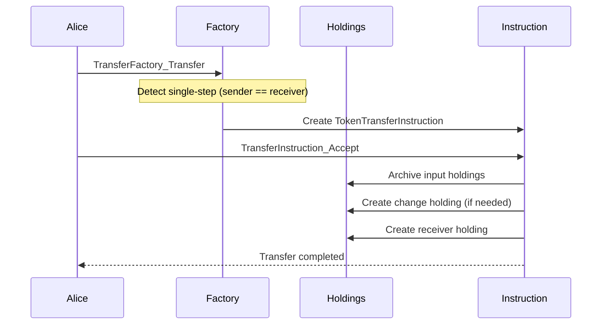
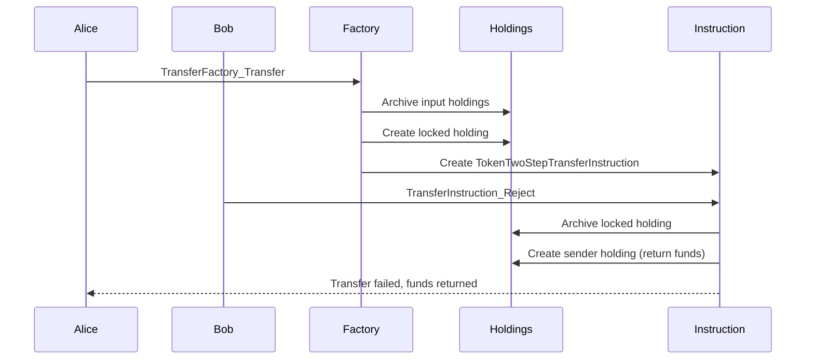

# Fungible Token Issuance and Transfer Workflow

## Overview

This document describes the comprehensive workflow for fungible token issuance and transfer operations in the DAML-based token system. The workflow covers token creation, initial distribution, and various transfer mechanisms including single-step and two-step transfers.

## Table of Contents

1. [System Architecture](#system-architecture)
2. [Token Setup Process](#token-setup-process)
3. [Transfer Mechanisms](#transfer-mechanisms)
4. [Test Scenarios](#test-scenarios)
5. [Sequence Diagrams](#sequence-diagrams)
6. [Error Handling](#error-handling)
7. [Key Components](#key-components)

## System Architecture

The fungible token system consists of several key components:

- **TokenTransferFactory**: Central factory for creating transfer instructions
- **TokenMintRequest**: Request-based token minting mechanism
- **TokenHolding**: Represents individual token holdings with optional locking
- **TokenTransferInstruction**: Single-step transfer mechanism
- **TokenTwoStepTransferInstruction**: Two-step transfer with receiver acceptance
- **TokenSetup**: Utility for initializing test environments

## Token Setup Process

### Initial Token Creation

The token setup process involves several steps:

1. **Party Allocation**: Create admin, alice, bob, and charlie parties
2. **Metadata Creation**: Define token metadata including name, symbol, and description
3. **Instrument ID Generation**: Create unique instrument identifier
4. **Factory Creation**: Deploy the TokenTransferFactory contract
5. **Mint Request Creation**: Participants create TokenMintRequest contracts
6. **Admin Approval**: Admin accepts mint requests to create actual holdings

```haskell
-- From Utils.daml
setupToken : Text -> Text -> InitBalances -> Script TokenSetup
setupToken tokenId tokenAdmin InitBalances{..} = script do
  admin <- allocatePartyByHint (PartyIdHint "fungible-admin")
  alice <- allocatePartyByHint (PartyIdHint "alice")
  bob <- allocatePartyByHint (PartyIdHint "bob")
  charlie <- allocatePartyByHint (PartyIdHint "charlie")
  
  let tokenMeta = MetaV1.Metadata with
        values = TextMap.fromList
          [ 
            ("name", tokenId),
            ("symbol", tokenId),
            ("issued-at", show now),
            ("description", "Test Fungible Token " <> tokenId),
            ("admin", tokenAdmin)
          ]

  let instrumentId = HoldingV1.InstrumentId with admin; id = tokenId
  transferFactoryCid <- submit admin $ createCmd TokenTransferFactory with admin; meta = tokenMeta
  
  -- create TokenMintRequest for each party
  aliceMintRequests <- forA aliceAmts $ \amt -> submit alice $ createCmd TokenMintRequest with instrumentId; recipient = alice; amount = amt
  bobMintRequests <- forA bobAmts $ \amt -> submit bob $ createCmd TokenMintRequest with instrumentId; recipient = bob; amount = amt
  charlieMintRequests <- forA charlieAmts $ \amt -> submit charlie $ createCmd TokenMintRequest with instrumentId; recipient = charlie; amount = amt

  -- Token Admin accept the mint requests
  forA_ aliceMintRequests $ \mintRequest -> submit admin $ exerciseCmd mintRequest AcceptMint
  forA_ bobMintRequests $ \mintRequest -> submit admin $ exerciseCmd mintRequest AcceptMint
  forA_ charlieMintRequests $ \mintRequest -> submit admin $ exerciseCmd mintRequest AcceptMint
```

### Token Minting Workflow

The system now uses a two-step minting process for better control and auditability:

1. **Mint Request Creation**: Participants create `TokenMintRequest` contracts specifying:
   - `instrumentId`: The token to be minted
   - `recipient`: The intended holder
   - `amount`: The quantity to mint

2. **Admin Approval**: The token admin reviews and accepts mint requests:
   - Creates actual `TokenHolding` contracts
   - Archives the `TokenMintRequest` contracts
   - Ensures proper authorization and compliance

### Benefits of Request-Based Minting

The new minting workflow provides several advantages:

1. **Audit Trail**: All token creation requests are recorded and can be tracked
2. **Admin Control**: Token administrators maintain control over token supply
3. **Compliance**: Supports regulatory requirements for token issuance
4. **Flexibility**: Allows for conditional or time-delayed minting
5. **Transparency**: Clear separation between request and execution phases

## Transfer Mechanisms

### Single-Step Transfer

Single-step transfers occur when:

- Sender equals receiver (self-transfer)
- Client provides unlocked input holdings

**Process:**

1. Create TokenTransferInstruction contract
2. Status set to `TransferPendingReceiverAcceptance`
3. Receiver can accept to complete transfer
4. Input holdings are consumed, new holdings created

### Two-Step Transfer

Two-step transfers occur when:

- Sender differs from receiver
- Requires receiver acceptance

**Process:**

1. Input holdings are locked and archived
2. Locked holding created for transfer amount
3. Change returned to sender immediately (if any)
4. TokenTwoStepTransferInstruction created
5. Receiver must accept to complete transfer

## Test Scenarios

### 1. Basic Issuance and Transfer (`testFungibleIssuanceAndTransfer`)

**Setup:**

- Alice: 150.0 tokens (100.0 + 50.0)
- Bob: 50.0 tokens
- Charlie: 1.0 token

**Transfers:**

1. Alice → Bob: 10.0 tokens
2. Bob → Charlie: 20.0 tokens

**Expected Final Balances:**

- Alice: 140.0 tokens
- Bob: 40.0 tokens
- Charlie: 21.0 tokens

### 2. Two-Step Reject (`testTwoStepReject`)

**Scenario:** Receiver rejects pending transfer instruction

**Result:** Funds return to sender, instruction fails

### 3. Two-Step Withdraw (`testTwoStepWithdraw`)

**Scenario:** Sender withdraws pending transfer instruction

**Result:** Funds return to sender, instruction fails

### 4. Expired Transfer (`testSingleStepExpiredAccept`)

**Scenario:** Transfer expires before acceptance

**Result:** Accept operation fails

### 5. Transfer Update Not Implemented (`testTransferUpdateNotImplemented`)

**Scenario:** Attempt to update transfer instruction

**Result:** Operation fails (not implemented)

### 6. Wrong Admin (`testFactoryWrongAdmin`)

**Scenario:** Call factory with incorrect expected admin

**Result:** Transfer creation fails

### 7. Insufficient Balance (`testTwoStepInsufficientBalance`)

**Scenario:** Attempt transfer with insufficient balance

**Result:** Transfer creation fails at factory level

## Sequence Diagrams

### Token Setup and Initial Distribution



### Two-Step Transfer Flow



### Single-Step Transfer Flow



### Transfer Rejection Flow



## Error Handling

### Validation Checks

**Factory Level:**

- Expected admin must match factory admin
- Valid instrument ID
- Positive transfer amount
- Valid timing (executeBefore > now)
- Sufficient balance for two-step transfers

**Instruction Level:**

- Transfer not expired
- Input holdings belong to sender
- Holdings have correct instrument
- Holdings are unlocked (for single-step)

### Common Failure Scenarios

1. **Insufficient Balance**: Transfer amount exceeds available holdings
2. **Expired Transfer**: Attempt to accept after executeBefore time
3. **Wrong Admin**: Expected admin doesn't match factory admin
4. **Locked Holdings**: Attempt to use locked holdings in single-step
5. **Invalid Instrument**: Holdings don't match transfer instrument

## Key Components

### TokenTransferFactory

**Purpose:** Central factory for creating transfer instructions
**Key Methods:**

- `transferFactory_transferImpl`: Creates transfer instructions
- `transferFactory_publicFetchImpl`: Retrieves factory view

**Logic:**

- Determines single-step vs two-step based on sender/receiver
- Validates all transfer parameters
- Handles input holding aggregation and locking

### TokenMintRequest

**Purpose:** Request-based token minting mechanism
**Key Properties:**

- `instrumentId`: Token to be minted
- `recipient`: Intended holder
- `amount`: Quantity to mint

**Key Methods:**

- `AcceptMint`: Admin choice to approve and execute minting

**Benefits:**

- Provides audit trail for token creation
- Enables admin control over token supply
- Supports compliance and regulatory requirements

### TokenHolding

**Purpose:** Represents individual token holdings
**Key Properties:**

- `admin`: Token administrator
- `owner`: Current holder
- `amount`: Token quantity
- `instrumentId`: Token identifier
- `lock`: Optional locking mechanism

### TokenTransferInstruction

**Purpose:** Single-step transfer mechanism
**Key Methods:**

- `transferInstruction_acceptImpl`: Executes transfer
- `transferInstruction_rejectImpl`: Aborts transfer
- `transferInstruction_withdrawImpl`: Withdraws transfer

### TokenTwoStepTransferInstruction

**Purpose:** Two-step transfer with receiver acceptance
**Key Methods:**

- `transferInstruction_acceptImpl`: Completes transfer
- `transferInstruction_rejectImpl`: Returns funds to sender
- `transferInstruction_withdrawImpl`: Returns funds to sender

## Implementation Notes

### Locking Mechanism

The system uses a sophisticated locking mechanism for two-step transfers:

```haskell
let lock = Some Api.Token.HoldingV1.Lock with
      holders = [transfer.instrumentId.admin]
      expiresAt = Some transfer.executeBefore
      expiresAfter = None
      context = Some ("transfer to " <> show transfer.receiver)
```

### Change Handling

The system automatically handles change when input holdings exceed transfer amount:

1. **Two-step**: Change returned immediately to sender
2. **Single-step**: Change created during acceptance

### Metadata Propagation

All operations maintain token metadata consistency across the system, ensuring proper tracking and compliance.

## Testing Strategy

The test suite covers:

1. **Happy Path**: Successful transfers and balance updates
2. **Error Conditions**: Invalid parameters and insufficient funds
3. **Edge Cases**: Expired transfers and self-transfers
4. **Security**: Admin validation and authorization
5. **State Management**: Proper holding creation and archival

This comprehensive testing ensures the system's reliability and correctness across all supported operations.
